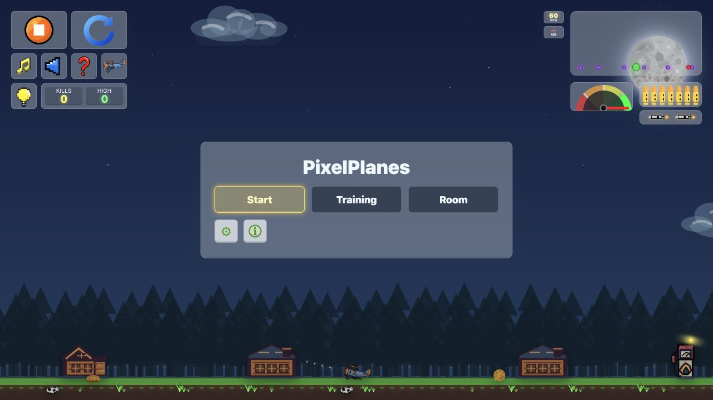
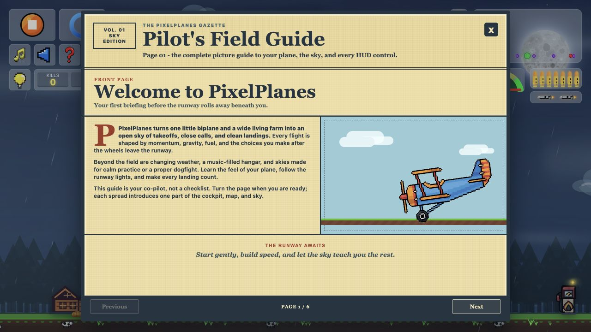
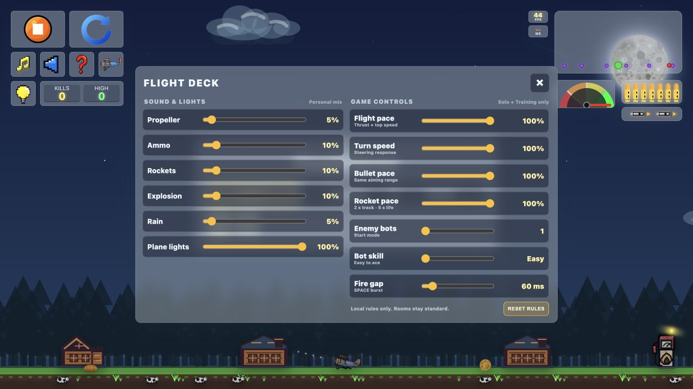

<h1 align="center">PixelPlanes</h1>

<p align="center"><strong>A real-time multiplayer browser flight game with adaptive AI pilots, regional rooms, and live voice chat.</strong></p>

<p align="center">
  <a href="https://pixelplanes.app/"><strong>▶ PLAY PIXELPLANES LIVE</strong></a>
  &nbsp;•&nbsp;
  <a href="#gameplay-highlights">Features</a>
  &nbsp;•&nbsp;
  <a href="#system-architecture">Architecture</a>
  &nbsp;•&nbsp;
  <a href="#run-locally">Run locally</a>
</p>

<p align="center">
  
  
  
  
  
</p>

<p align="center">
  <a href="https://pixelplanes.app/">
    
  </a>
</p>

PixelPlanes is a deployed full-stack game—not a static prototype. It combines a React/Vite game client with a Node.js WebSocket simulation service, Redis-backed regional room routing, and LiveKit voice infrastructure. Players can train, fight adaptive bots, or create private six-player rooms directly in the browser.

## Product Tour

| Guided pilot experience | Configurable solo gameplay |
| --- | --- |
|  |  |
| Six illustrated pages explain flight, navigation, combat, weather, and multiplayer. | The Flight Deck controls sound, game pace, bot skill, weapons, fuel, and weather without changing competitive room rules. |

## Gameplay Highlights

- Fly solo against configurable AI pilots or create a private room for up to six players.
- Learn the controls through guided training missions for takeoff, banking, refueling, weapons, and weather navigation.
- Fight with limited fuel, burst-fire bullets, homing rockets, damage, respawns, and score tracking.
- Adjust bot count and difficulty; opponents use target selection, pursuit, avoidance, recovery, and firing decisions.
- Use room-scoped real-time voice with microphone controls, speaker indicators, and per-player volume settings.
- Continue interrupted matches through short-lived reconnect sessions and automatic owner-region redirects.
- Play across day, night, rain, and fog conditions with music, accessibility-minded controls, and responsive layouts.

## System Architecture

```text
React 19 + Vite 8 game client (pixelplanes.app)
                     |
                     | sequenced controls / 20 Hz snapshots
                     v
Regional Node.js + WebSocket room service
       |                 |                    |
       v                 v                    v
60 Hz simulation   Redis room directory   LiveKit voice
       |
       v
Optional PostgreSQL room-event logging
```

The browser sends control input rather than authoritative positions or scores. One regional Node.js service owns each match, simulates the shared world at 60 Hz, and sends snapshots at 20 Hz. The local pilot uses client prediction and smooth correction; remote pilots are interpolated between server snapshots.

## Live Multiplayer Topology

The production frontend can measure all three public services and place new rooms in the quickest available region:

- **US East:** `pixelplanes-realtime-us.onrender.com`
- **Europe:** `pixelplanes-realtime-eu.onrender.com`
- **Asia:** `pixelplanes-realtime-asia.onrender.com`

All three services currently expose routing-ready health checks and share a Redis-backed room directory. If a player reaches the wrong region for an existing room, the server returns a validated redirect to the room owner. Each match remains on exactly one authoritative simulation service; gameplay state is not replicated frame-by-frame through Redis.

LiveKit Cloud carries room voice through its managed media network. The game server issues a short-lived token only after a player joins a PixelPlanes room. Tokens are limited to one room and identity, and no LiveKit key or secret is sent to the browser.

PostgreSQL room-event logging is implemented as an optional backend capability. It is not required for current live matches and should not be interpreted as active production persistence when a regional health response reports `db: false`.

## Technology

- **Client:** React 19, Vite 8, JavaScript, HTML5 Canvas, responsive CSS
- **Realtime backend:** Node.js, `ws`, server-authoritative room simulation
- **Voice:** LiveKit client/server SDKs and room-scoped access tokens
- **Routing:** Redis/Valkey room ownership, lease refresh, and regional redirects
- **Data:** Optional PostgreSQL event logging through `pg`
- **Deployment:** Vercel frontend and always-on Render WebSocket services
- **Quality:** Node test runner coverage for bot AI, room rules, protocol security, reconnection, regional routing, and voice authorization

## Multiplayer Contract and Safety

- Clients send sequenced `power`, directional, fire, light, and rocket controls.
- The server owns flight state, fuel, ammunition, reloads, projectiles, collision, damage, kills, and respawns.
- Room sessions use opaque reconnect tokens stored in browser session storage and allow a 30-second recovery window.
- Production servers validate allowed origins, reject client-authored state and scores, cap message sizes, and rate-limit inbound messages.
- Standard multiplayer rules remain fixed so solo/training sliders cannot alter a competitive room.

## Run Locally

```bash
git clone https://github.com/Shashankpabitwar123/pixelplanes.git
cd pixelplanes
npm install
npm run dev
```

Vite normally serves the client at `http://127.0.0.1:5173/`.

Run the WebSocket service in a second terminal:

```bash
npm run server:start
```

Default local service endpoints:

```text
GET  http://127.0.0.1:4000/health
GET  http://127.0.0.1:4000/voice/ice-servers
WS   ws://127.0.0.1:4000/rooms
```

## Environment Configuration

Frontend:

```bash
VITE_WS_URL=wss://pixelplanes-realtime-eu.onrender.com/rooms
VITE_API_URL=https://pixelplanes-realtime-eu.onrender.com
VITE_MULTIPLAYER_REGIONS='["wss://pixelplanes-realtime-us.onrender.com/rooms","wss://pixelplanes-realtime-eu.onrender.com/rooms","wss://pixelplanes-realtime-asia.onrender.com/rooms"]'
```

Realtime service:

```bash
CLIENT_ORIGIN=https://pixelplanes.app
REGIONAL_ROOMS_ENABLED=true
REGION_ID=eu
PUBLIC_WS_URL=wss://pixelplanes-realtime-eu.onrender.com/rooms
REDIS_URL=rediss://your-managed-redis-url
LIVEKIT_URL=wss://your-project.livekit.cloud
LIVEKIT_API_KEY=your-livekit-api-key
LIVEKIT_API_SECRET=your-livekit-api-secret
DATABASE_URL=optional-postgresql-url
```

Give each regional service its own `REGION_ID` and `PUBLIC_WS_URL`, while sharing the same Redis directory and allowed frontend origin. Keep LiveKit, Redis, TURN, and database secrets exclusively on the server. Never expose them through `VITE_*` variables.

## Validate the Project

```bash
npm run test:bot
npm run test:room
npm run test:server
npm run test:directory
npm run test:voice
npm run build
```

The suites exercise adaptive bot behavior, simulation rules, forged-state rejection, reconnection, safe regional activation, owner-region redirects, and room-scoped LiveKit authorization.

## Production Hardening

The live game already uses regional room services, Redis routing, and LiveKit voice. Further scaling work should focus on structured observability, regional load testing, capacity alerts, failure drills, and long-running match soak tests before increasing room or concurrency limits.
